# Product Roadmap with RICE Scoring
# AI Part Designer

**Version:** 1.1  
**Date:** 2026-01-25  
**Status:** Active  

---

## Executive Summary

This roadmap outlines the phased delivery of AI Part Designer, prioritized using RICE scoring methodology. The MVP focuses on core value delivery with a 17-23 week timeline.

**🔴 URGENT:** Phase 3.5 (Critical Bug Fixes) has been added to address blocking issues discovered in production testing.

---

## RICE Scoring Methodology

**RICE = (Reach × Impact × Confidence) / Effort**

| Factor | Description | Scale |
|--------|-------------|-------|
| **Reach** | Users impacted per quarter | 1-10 (1000s of users) |
| **Impact** | Impact on user goals | 0.25 (minimal) to 3 (massive) |
| **Confidence** | Certainty in estimates | 0.5-1.0 (50%-100%) |
| **Effort** | Person-months required | Actual estimate |

---

## Phase 3.5: Critical Bug Fixes (Week 18) 🔴 BLOCKER
*Must fix before launch - these issues block core user workflows*

### 3.5.1 Dashboard & Core Functionality
| Bug | Reach | Impact | Confidence | Effort | RICE | Priority |
|-----|-------|--------|------------|--------|------|----------|
| Dashboard Recent Designs (static data) | 10 | 3 | 1.0 | 0.25 | 120 | P0 |
| Projects Page filter error | 10 | 3 | 1.0 | 0.15 | 200 | P0 |
| File Upload not working | 10 | 3 | 0.9 | 0.25 | 108 | P0 |
| Save Design from Chat missing | 10 | 3 | 1.0 | 0.4 | 75 | P0 |

### 3.5.2 Templates System
| Bug | Reach | Impact | Confidence | Effort | RICE | Priority |
|-----|-------|--------|------------|--------|------|----------|
| No templates available | 10 | 2 | 1.0 | 0.15 | 133 | P0 |
| Can't create templates | 8 | 2 | 0.9 | 0.25 | 57.6 | P0 |
| Template creation UI missing | 8 | 2 | 0.9 | 0.25 | 57.6 | P0 |

### 3.5.3 Sharing
| Bug | Reach | Impact | Confidence | Effort | RICE | Priority |
|-----|-------|--------|------------|--------|------|----------|
| Sharing page not implemented | 6 | 2 | 0.9 | 0.5 | 21.6 | P1 |

**Sprint 36 Deliverables:**
- [x] All dashboard links functional (no console errors)
- [x] Users can complete full design workflow: create → save → find in library
- [x] Template browsing and creation works
- [x] Basic sharing functionality works

---

## Phase 0: Foundation (Weeks 1-3)
*Gap resolution and infrastructure setup*

### 0.1 Technology Validation
| Item | Reach | Impact | Confidence | Effort | RICE |
|------|-------|--------|------------|--------|------|
| CAD Library POC | 10 | 3 | 0.6 | 0.5 | 36 |
| AI-to-CAD POC | 10 | 3 | 0.6 | 0.5 | 36 |

**Deliverables:**
- [ ] CadQuery POC demonstrating basic part generation
- [ ] GPT-4 → CAD operations pipeline validated
- [ ] Performance benchmarks documented
- [ ] Risk assessment updated

### 0.2 Infrastructure Setup
| Item | Reach | Impact | Confidence | Effort | RICE |
|------|-------|--------|------------|--------|------|
| Repository Structure | 10 | 1 | 1.0 | 0.25 | 40 |
| CI/CD Pipeline | 10 | 1 | 0.9 | 0.5 | 18 |
| Development Environment | 10 | 1 | 0.9 | 0.25 | 36 |
| IaC Foundation | 10 | 1 | 0.8 | 0.5 | 16 |

**Deliverables:**
- [ ] Monorepo structure (frontend/, backend/, infrastructure/)
- [ ] GitHub Actions CI/CD workflows
- [ ] Docker Compose local development
- [ ] Terraform modules for AWS

---

## Phase 1: Core MVP (Weeks 4-12)
*Essential features for user value*

### 1.1 User Authentication (Weeks 4-5)
| Feature | Reach | Impact | Confidence | Effort | RICE | Priority |
|---------|-------|--------|------------|--------|------|----------|
| User Registration | 10 | 2 | 0.9 | 1 | 18 | Must Have |
| Email/Password Login | 10 | 2 | 0.9 | 0.5 | 36 | Must Have |
| Password Reset | 10 | 1 | 0.9 | 0.5 | 18 | Must Have |
| JWT Auth | 10 | 2 | 0.9 | 0.5 | 36 | Must Have |

**User Stories:** US-101, US-102, US-103

### 1.2 Template Library (Weeks 5-7)
| Feature | Reach | Impact | Confidence | Effort | RICE | Priority |
|---------|-------|--------|------------|--------|------|----------|
| Template Catalog | 8 | 2 | 0.9 | 1 | 14.4 | Must Have |
| Template Preview | 8 | 1.5 | 0.9 | 0.5 | 21.6 | Must Have |
| Parameter Customization | 8 | 2 | 0.8 | 1.5 | 8.5 | Must Have |
| 10 Core Templates | 8 | 2 | 0.8 | 2 | 6.4 | Must Have |

**User Stories:** US-202, US-203

**Core Templates:**
1. Project Box (rectangular enclosure)
2. Project Box with Lid
3. L-Bracket
4. Corner Bracket
5. Cylindrical Container
6. Cable Clip
7. Phone/Tablet Stand
8. Pegboard Hook
9. Drawer Divider
10. Spacer/Standoff

### 1.3 Natural Language Generation (Weeks 6-9)
| Feature | Reach | Impact | Confidence | Effort | RICE | Priority |
|---------|-------|--------|------------|--------|------|----------|
| Description Parser | 10 | 3 | 0.7 | 2 | 10.5 | Must Have |
| CAD Generation | 10 | 3 | 0.6 | 3 | 6.0 | Must Have |
| Basic Modification | 8 | 2 | 0.7 | 1.5 | 7.5 | Must Have |
| Dimension Extraction | 9 | 2 | 0.8 | 1 | 14.4 | Must Have |

**User Stories:** US-201, US-205

### 1.4 File Management (Weeks 8-10)
| Feature | Reach | Impact | Confidence | Effort | RICE | Priority |
|---------|-------|--------|------------|--------|------|----------|
| File Upload (STEP/STL) | 8 | 2 | 0.9 | 1 | 14.4 | Must Have |
| 3D Preview | 9 | 2 | 0.8 | 1.5 | 9.6 | Must Have |
| Export (STL, STEP) | 9 | 2 | 0.9 | 1 | 16.2 | Must Have |
| Download Files | 9 | 1.5 | 0.9 | 0.5 | 24.3 | Must Have |

**User Stories:** US-301, US-302, US-303

### 1.5 Job Queue (Weeks 9-11)
| Feature | Reach | Impact | Confidence | Effort | RICE | Priority |
|---------|-------|--------|------------|--------|------|----------|
| Job Submission | 10 | 2 | 0.9 | 1 | 18 | Must Have |
| Status Tracking | 10 | 1.5 | 0.9 | 1 | 13.5 | Must Have |
| Progress Updates | 8 | 1 | 0.8 | 0.5 | 12.8 | Should Have |
| Email Notifications | 6 | 0.5 | 0.9 | 0.5 | 5.4 | Should Have |

**User Stories:** US-401, US-402

### 1.6 Dashboard (Weeks 10-12)
| Feature | Reach | Impact | Confidence | Effort | RICE | Priority |
|---------|-------|--------|------------|--------|------|----------|
| User Dashboard | 10 | 1.5 | 0.9 | 1 | 13.5 | Must Have |
| Recent Designs | 10 | 1 | 0.9 | 0.5 | 18 | Must Have |
| Job Status View | 10 | 1 | 0.9 | 0.5 | 18 | Must Have |
| Quick Actions | 8 | 0.5 | 0.9 | 0.25 | 14.4 | Should Have |

**User Stories:** US-501

---

## Phase 2: Monetization & Polish (Weeks 13-17)
*Revenue enablement and UX improvements*

### 2.1 Subscription System (Weeks 13-14)
| Feature | Reach | Impact | Confidence | Effort | RICE | Priority |
|---------|-------|--------|------------|--------|------|----------|
| Stripe Integration | 10 | 2 | 0.9 | 1.5 | 12 | Must Have |
| Tier Enforcement | 10 | 2 | 0.9 | 1 | 18 | Must Have |
| Upgrade Flow | 8 | 2 | 0.9 | 1 | 14.4 | Must Have |
| Billing Portal | 6 | 1 | 0.9 | 0.5 | 10.8 | Should Have |

**User Stories:** US-601, US-602, US-603

### 2.2 Priority Queue (Week 14)
| Feature | Reach | Impact | Confidence | Effort | RICE | Priority |
|---------|-------|--------|------------|--------|------|----------|
| Priority Queues | 4 | 2 | 0.9 | 0.5 | 14.4 | Must Have |
| Tier-based Routing | 4 | 2 | 0.9 | 0.5 | 14.4 | Must Have |

**User Stories:** US-403

### 2.3 Abuse Detection (Weeks 14-16)
| Feature | Reach | Impact | Confidence | Effort | RICE | Priority |
|---------|-------|--------|------------|--------|------|----------|
| Keyword Filter | 10 | 2 | 0.9 | 0.5 | 36 | Must Have |
| OpenAI Moderation | 10 | 2 | 0.9 | 0.5 | 36 | Must Have |
| Intent Classification | 10 | 2 | 0.7 | 1 | 14 | Must Have |
| Rate Limiting | 10 | 1 | 0.9 | 0.5 | 18 | Must Have |

**User Stories:** US-802

### 2.4 Version History (Week 15)
| Feature | Reach | Impact | Confidence | Effort | RICE | Priority |
|---------|-------|--------|------------|--------|------|----------|
| Design Versions | 6 | 1.5 | 0.9 | 1 | 8.1 | Should Have |
| Version Compare | 4 | 1 | 0.8 | 0.5 | 6.4 | Could Have |
| Restore Version | 5 | 1.5 | 0.9 | 0.5 | 13.5 | Should Have |

**User Stories:** US-304

### 2.5 AI Suggestions (Weeks 16-17)
| Feature | Reach | Impact | Confidence | Effort | RICE | Priority |
|---------|-------|--------|------------|--------|------|----------|
| Printability Analysis | 7 | 1.5 | 0.7 | 1 | 7.35 | Should Have |
| Optimization Tips | 6 | 1 | 0.6 | 1 | 3.6 | Could Have |
| Suggestion UI | 7 | 1 | 0.8 | 0.5 | 11.2 | Should Have |

**User Stories:** US-204

---

## Phase 3: Launch Prep (Weeks 18-20)
*Hardening, testing, documentation*

### 3.1 Testing & QA (Weeks 18-19)
| Item | Reach | Impact | Confidence | Effort | RICE | Priority |
|------|-------|--------|------------|--------|------|----------|
| Unit Tests (80% coverage) | 10 | 2 | 0.9 | 2 | 9 | Must Have |
| Integration Tests | 10 | 2 | 0.9 | 1.5 | 12 | Must Have |
| E2E Tests (critical paths) | 10 | 1.5 | 0.8 | 1 | 12 | Must Have |
| Performance Testing | 10 | 1.5 | 0.8 | 0.5 | 24 | Should Have |
| Security Audit | 10 | 2 | 0.9 | 1 | 18 | Must Have |

### 3.2 Documentation (Week 19)
| Item | Reach | Impact | Confidence | Effort | RICE | Priority |
|------|-------|--------|------------|--------|------|----------|
| User Guide | 10 | 1 | 0.9 | 1 | 9 | Must Have |
| API Documentation | 6 | 1 | 0.9 | 0.5 | 10.8 | Must Have |
| Onboarding Tutorial | 8 | 1.5 | 0.8 | 0.5 | 19.2 | Should Have |

### 3.3 Production Deployment (Week 20)
| Item | Reach | Impact | Confidence | Effort | RICE | Priority |
|------|-------|--------|------------|--------|------|----------|
| Production Infrastructure | 10 | 2 | 0.9 | 1 | 18 | Must Have |
| Monitoring Setup | 10 | 1.5 | 0.9 | 0.5 | 27 | Must Have |
| Backup Verification | 10 | 2 | 0.9 | 0.5 | 36 | Must Have |
| Runbooks | 10 | 1 | 0.8 | 0.5 | 16 | Should Have |

---

## Phase 4: Post-Launch (Weeks 21+)
*Iteration based on user feedback*

### 4.1 Enhancements Backlog
| Feature | Reach | Impact | Confidence | Effort | RICE | Phase |
|---------|-------|--------|------------|--------|------|-------|
| Project Organization | 7 | 1 | 0.9 | 1 | 6.3 | 4.1 |
| Design Search | 6 | 1 | 0.9 | 0.5 | 10.8 | 4.1 |
| Trash Bin | 5 | 1 | 0.9 | 0.5 | 9 | 4.1 |
| Design Sharing (View) | 5 | 1.5 | 0.8 | 1 | 6 | 4.2 |
| Comments | 3 | 0.5 | 0.7 | 1 | 1.05 | 4.3 |
| OAuth (Google/GitHub) | 4 | 1 | 0.9 | 1 | 3.6 | 4.2 |
| Admin Dashboard | 2 | 1.5 | 0.9 | 1.5 | 1.8 | 4.1 |
| User Management | 2 | 1 | 0.9 | 1 | 1.8 | 4.1 |
| More Templates | 8 | 1 | 0.9 | 2 | 3.6 | Ongoing |
| Export Formats (OBJ, 3MF) | 5 | 0.5 | 0.9 | 0.5 | 4.5 | 4.2 |
| Data Export | 3 | 1 | 0.9 | 0.5 | 5.4 | 4.3 |

---

## Phase 5: AI Assistant Enhancements (Weeks 22-30)
*Enhanced AI capabilities and user experience*

### 5.1 AI Chat Commands & Intelligence
| Feature | Reach | Impact | Confidence | Effort | RICE | Priority |
|---------|-------|--------|------------|--------|------|----------|
| Slash Commands (/save, /export, etc.) | 9 | 2 | 0.9 | 1 | 16.2 | P1 |
| Command Autocomplete | 9 | 1 | 0.9 | 0.5 | 16.2 | P1 |
| Gridfinity Pattern Understanding | 6 | 2 | 0.7 | 1.5 | 5.6 | P1 |
| Dovetail Joint Generation | 5 | 2 | 0.7 | 1.5 | 4.7 | P1 |
| Complex Constraint Understanding | 8 | 2.5 | 0.6 | 2 | 6.0 | P1 |
| Clarifying Questions | 10 | 2 | 0.8 | 1 | 16.0 | P0 |
| Multi-step Design Workflows | 7 | 2 | 0.7 | 2 | 4.9 | P1 |

**User Stories:** US-5001 to US-5007

### 5.2 AI Performance & Manufacturing
| Feature | Reach | Impact | Confidence | Effort | RICE | Priority |
|---------|-------|--------|------------|--------|------|----------|
| Response Time Optimization | 10 | 2 | 0.9 | 2 | 9.0 | P0 |
| Streaming Responses | 8 | 1.5 | 0.8 | 1 | 9.6 | P1 |
| 3D Print Optimization | 7 | 2 | 0.8 | 1.5 | 7.5 | P1 |
| Material Recommendations | 7 | 1.5 | 0.8 | 1 | 8.4 | P1 |
| Print Settings Suggestions | 6 | 1.5 | 0.8 | 1 | 7.2 | P1 |
| Manufacturer Constraints (3D vs CNC) | 8 | 2 | 0.7 | 1.5 | 7.5 | P0 |
| Printability Warnings | 8 | 1.5 | 0.8 | 1 | 9.6 | P1 |

**User Stories:** US-5101 to US-5107

---

## Phase 6: User Experience & Theming (Weeks 31-38)
*Design system overhaul and privacy features*

### 6.1 Design System & Theming
| Feature | Reach | Impact | Confidence | Effort | RICE | Priority |
|---------|-------|--------|------------|--------|------|----------|
| Industrial Brand Color Palette | 10 | 1.5 | 0.9 | 1 | 13.5 | P0 |
| Dark Mode (Primary) | 10 | 2 | 0.9 | 1.5 | 12.0 | P0 |
| Light Mode Alternative | 8 | 1 | 0.9 | 1 | 7.2 | P1 |
| Theme Persistence | 10 | 0.5 | 0.9 | 0.25 | 18.0 | P1 |
| Remove "Create" Button from Nav | 10 | 0.5 | 1.0 | 0.1 | 50.0 | P0 |
| Slide-out History Tray | 9 | 1.5 | 0.8 | 1 | 10.8 | P1 |
| Conversation History Redesign | 8 | 1 | 0.8 | 1 | 6.4 | P1 |

**User Stories:** US-6001 to US-6007

### 6.2 Chat History & Privacy
| Feature | Reach | Impact | Confidence | Effort | RICE | Priority |
|---------|-------|--------|------------|--------|------|----------|
| Persistent Conversation Storage | 10 | 2 | 0.9 | 1 | 18.0 | P0 |
| Conversation List Panel | 10 | 1.5 | 0.9 | 1 | 13.5 | P0 |
| Search Within Conversations | 7 | 1 | 0.8 | 0.5 | 11.2 | P1 |
| Export History (PDF, TXT, JSON) | 5 | 1 | 0.8 | 1 | 4.0 | P1 |
| Delete Individual Conversations | 10 | 2 | 0.9 | 0.5 | 36.0 | P0 |
| Delete All Chat History | 10 | 1.5 | 0.9 | 0.25 | 54.0 | P0 |
| Data Retention Settings | 4 | 1 | 0.7 | 0.5 | 5.6 | P2 |
| Privacy Dashboard | 6 | 1 | 0.8 | 0.5 | 9.6 | P1 |

**User Stories:** US-6101 to US-6108

---

## Phase 7: User Feedback & Personalization (Weeks 39-46)
*Quality improvement through feedback and customization*

### 7.1 Response Rating & Feedback
| Feature | Reach | Impact | Confidence | Effort | RICE | Priority |
|---------|-------|--------|------------|--------|------|----------|
| Thumbs Up/Down on Responses | 10 | 1.5 | 0.9 | 0.5 | 27.0 | P0 |
| Optional Feedback Text | 8 | 1 | 0.8 | 0.25 | 25.6 | P1 |
| Rating Analytics Dashboard | 3 | 1.5 | 0.8 | 1 | 3.6 | P1 |
| Save Favorite Responses | 7 | 1.5 | 0.8 | 1 | 8.4 | P1 |
| Organize Favorites with Tags | 5 | 0.5 | 0.7 | 0.5 | 3.5 | P2 |
| Quick Reference Panel | 5 | 1 | 0.8 | 0.5 | 8.0 | P1 |
| Detailed Feedback Form | 6 | 1 | 0.7 | 0.5 | 8.4 | P1 |

**User Stories:** US-7001 to US-7007

### 7.2 AI Personalization
| Feature | Reach | Impact | Confidence | Effort | RICE | Priority |
|---------|-------|--------|------------|--------|------|----------|
| Custom AI Assistant Name | 8 | 0.5 | 0.9 | 0.25 | 14.4 | P2 |
| Response Style Presets | 7 | 1.5 | 0.8 | 1 | 8.4 | P1 |
| Custom Personality Instructions | 5 | 1 | 0.7 | 1 | 3.5 | P2 |
| Voice Output (TTS) | 4 | 1.5 | 0.6 | 1.5 | 2.4 | P2 |
| Voice Input (STT) | 4 | 1.5 | 0.6 | 1.5 | 2.4 | P2 |
| Hands-free Interaction Mode | 3 | 1.5 | 0.5 | 1.5 | 1.5 | P3 |

**User Stories:** US-7101 to US-7106

---

## Phase 8: Admin & Analytics (Weeks 47-54)
*Platform management and observability*

### 8.1 Admin Dashboard Improvements
| Feature | Reach | Impact | Confidence | Effort | RICE | Priority |
|---------|-------|--------|------------|--------|------|----------|
| Real-time Usage Dashboard | 2 | 2.5 | 0.9 | 1 | 4.5 | P0 |
| User Activity Analytics | 2 | 2 | 0.9 | 1 | 3.6 | P0 |
| Generation Success/Failure Rates | 2 | 2 | 0.9 | 0.5 | 7.2 | P0 |
| API Performance Monitoring | 2 | 1.5 | 0.9 | 1 | 2.7 | P1 |
| Revenue Analytics | 2 | 2 | 0.8 | 1 | 3.2 | P1 |
| User Search/Filtering | 2 | 1.5 | 0.9 | 0.5 | 5.4 | P0 |
| User Detail View | 2 | 1.5 | 0.9 | 1 | 2.7 | P1 |
| Bulk User Actions | 2 | 1 | 0.9 | 0.5 | 3.6 | P1 |
| Role/Permission Management | 2 | 1.5 | 0.8 | 1 | 2.4 | P1 |

**User Stories:** US-8001 to US-8009

### 8.2 Logging & Audit
| Feature | Reach | Impact | Confidence | Effort | RICE | Priority |
|---------|-------|--------|------------|--------|------|----------|
| Structured Logging | 3 | 2 | 0.9 | 1 | 5.4 | P0 |
| Log Search Interface | 2 | 1.5 | 0.8 | 1 | 2.4 | P1 |
| Log Retention Policies | 2 | 1 | 0.9 | 0.5 | 3.6 | P1 |
| User Action Audit Trail | 3 | 2 | 0.9 | 1 | 5.4 | P0 |
| Admin Action Audit Trail | 2 | 2 | 0.9 | 0.5 | 7.2 | P0 |
| Audit Log Export | 2 | 1 | 0.9 | 0.5 | 3.6 | P1 |
| Error Alerting | 3 | 1.5 | 0.8 | 1 | 3.6 | P1 |
| System Health Dashboard | 3 | 1.5 | 0.8 | 1 | 3.6 | P1 |

**User Stories:** US-8101 to US-8108

---

## Phase 9: Social & Collaboration (Weeks 55-62)
*Community features and team capabilities*

### 9.1 Sharing & Social Features
| Feature | Reach | Impact | Confidence | Effort | RICE | Priority |
|---------|-------|--------|------------|--------|------|----------|
| Share to Social Media | 6 | 0.5 | 0.8 | 1 | 2.4 | P2 |
| Email Sharing with Preview | 5 | 1 | 0.9 | 0.5 | 9.0 | P2 |
| Shareable Public/Unlisted Links | 8 | 1.5 | 0.9 | 0.5 | 21.6 | P1 |
| Embed Code for Websites | 4 | 0.5 | 0.8 | 0.5 | 3.2 | P2 |
| Invite Collaborators | 5 | 2 | 0.7 | 2 | 3.5 | P1 |
| Shared Team Workspaces | 4 | 2 | 0.6 | 2 | 2.4 | P2 |
| Real-time Collaborative Editing | 3 | 2 | 0.5 | 3 | 1.0 | P3 |
| Team Conversation History | 4 | 1.5 | 0.7 | 1 | 4.2 | P2 |

**User Stories:** US-9001 to US-9008

### 9.2 Multi-Language Support
| Feature | Reach | Impact | Confidence | Effort | RICE | Priority |
|---------|-------|--------|------------|--------|------|----------|
| i18n Framework Setup | 10 | 1 | 0.9 | 1 | 9.0 | P1 |
| Language Detection/Selection | 10 | 1 | 0.9 | 0.5 | 18.0 | P1 |
| Initial Language Pack (6 langs) | 10 | 1.5 | 0.8 | 2 | 6.0 | P1 |
| AI Responses in User Language | 10 | 1.5 | 0.7 | 1 | 10.5 | P1 |
| Translation Management | 5 | 1 | 0.7 | 1 | 3.5 | P2 |
| RTL Language Support | 4 | 1 | 0.6 | 1 | 2.4 | P2 |

**User Stories:** US-9101 to US-9106

---

## Phase 10: Mobile & Extended Platforms (Weeks 63-76)
*Native mobile and PWA capabilities*

### 10.1 Mobile Application
| Feature | Reach | Impact | Confidence | Effort | RICE | Priority |
|---------|-------|--------|------------|--------|------|----------|
| React Native Project Setup | 8 | 1 | 0.9 | 1 | 7.2 | P1 |
| Mobile Authentication | 8 | 2 | 0.9 | 1 | 14.4 | P0 |
| Mobile Chat Interface | 8 | 2 | 0.8 | 2 | 6.4 | P0 |
| Mobile 3D Preview | 7 | 1.5 | 0.7 | 2 | 3.7 | P1 |
| Design Management (Mobile) | 7 | 1.5 | 0.8 | 1 | 8.4 | P1 |
| Push Notifications | 6 | 1 | 0.9 | 1 | 5.4 | P1 |
| Offline Design Viewing | 5 | 1 | 0.7 | 2 | 1.75 | P2 |
| Camera for Reference Photos | 6 | 1.5 | 0.7 | 1 | 6.3 | P2 |
| App Store Submissions | 8 | 1 | 0.9 | 0.5 | 14.4 | P0 |

**User Stories:** US-10001 to US-10009

### 10.2 Progressive Web App
| Feature | Reach | Impact | Confidence | Effort | RICE | Priority |
|---------|-------|--------|------------|--------|------|----------|
| Service Worker (Offline) | 10 | 1 | 0.9 | 1 | 9.0 | P1 |
| App Manifest & Installation | 10 | 0.5 | 0.9 | 0.25 | 18.0 | P1 |
| Background Sync | 8 | 1 | 0.7 | 1 | 5.6 | P2 |
| Web Push Notifications | 7 | 1 | 0.8 | 1 | 5.6 | P2 |
| Installation Prompt | 10 | 0.5 | 0.9 | 0.25 | 18.0 | P1 |

**User Stories:** US-10101 to US-10105

---

## Milestone Summary

| Milestone | Weeks | Key Deliverables | Success Criteria |
|-----------|-------|------------------|------------------|
| **M0: Foundation** | 1-3 | POCs validated, infra ready | CAD + AI working |
| **M1: Core MVP** | 4-12 | Auth, templates, generation, files | Users can create designs |
| **M2: Monetization** | 13-17 | Subscriptions, queue priority, moderation | Revenue enabled |
| **M3: Launch** | 18-20 | Testing, docs, production | Production ready |
| **M4: Growth** | 21+ | Enhancements, feedback | User satisfaction |
| **M5: AI Enhancement** | 22-30 | Commands, manufacturing, performance | Smarter AI |
| **M6: UX Overhaul** | 31-38 | Theming, privacy, history | Industrial design |
| **M7: Quality Loop** | 39-46 | Ratings, personalization | User-driven improvement |
| **M8: Admin Tools** | 47-54 | Dashboard, logging, audit | Platform management |
| **M9: Community** | 55-62 | Sharing, i18n, collaboration | Global reach |
| **M10: Mobile** | 63-76 | Native apps, PWA | Cross-platform access |

---

## Extended Resource Allocation

### Team Composition (Full Enhancement Phase)
| Role | Count | Focus |
|------|-------|-------|
| Backend Engineer | 2 | API, AI, CAD |
| Frontend Engineer | 2 | React, Mobile |
| Mobile Developer | 1 | React Native (Phase 10) |
| DevOps/SRE | 1 | Infrastructure, CI/CD |
| Product Manager | 0.5 | Requirements, testing |
| Designer | 0.5 | UI/UX, themes |
| Localization | 0.25 | i18n (Phase 9) |

### Effort by Phase (Extended)
| Phase | Backend | Frontend | DevOps | Total |
|-------|---------|----------|--------|-------|
| Phase 0 | 3 weeks | 1 week | 2 weeks | 6 person-weeks |
| Phase 1 | 12 weeks | 8 weeks | 2 weeks | 22 person-weeks |
| Phase 2 | 8 weeks | 4 weeks | 1 week | 13 person-weeks |
| Phase 3 | 4 weeks | 2 weeks | 2 weeks | 8 person-weeks |
| Phase 5 | 8 weeks | 6 weeks | 1 week | 15 person-weeks |
| Phase 6 | 4 weeks | 8 weeks | 1 week | 13 person-weeks |
| Phase 7 | 4 weeks | 6 weeks | 0.5 weeks | 10.5 person-weeks |
| Phase 8 | 8 weeks | 4 weeks | 2 weeks | 14 person-weeks |
| Phase 9 | 4 weeks | 8 weeks | 1 week | 13 person-weeks |
| Phase 10 | 4 weeks | 16 weeks | 2 weeks | 22 person-weeks |
| **Total** | **59 weeks** | **63 weeks** | **14.5 weeks** | **136.5 person-weeks** |

---

## Risk-Adjusted Timeline (Full Product)

| Scenario | Timeline | Confidence |
|----------|----------|------------|
| Optimistic | 17 weeks (MVP) / 60 weeks (Full) | 20% |
| Expected | 20 weeks (MVP) / 76 weeks (Full) | 60% |
| Pessimistic | 25 weeks (MVP) / 90 weeks (Full) | 20% |

**Weighted Average: 20.6 weeks (MVP) / 76 weeks (Full Product)**

---

## Success Metrics (Extended)

### MVP Launch (Week 20)
- [ ] 100 beta users registered
- [ ] 500 designs generated
- [ ] 90% generation success rate
- [ ] < 60 second average generation time
- [ ] 99.5% uptime during beta

### Month 3 Post-Launch
- [ ] 2,000 registered users
- [ ] 200 paying subscribers (10% conversion)
- [ ] NPS > 40
- [ ] < 5 critical bugs
- [ ] $3,800 MRR

### Month 6 Post-Launch
- [ ] 10,000 registered users
- [ ] 1,500 paying subscribers (15% conversion)
- [ ] NPS > 50
- [ ] 99.9% uptime
- [ ] $28,500 MRR

### Year 1 (Full Enhancement Phases)
- [ ] 50,000 registered users
- [ ] 7,500 paying subscribers (15% conversion)
- [ ] AI response time < 3 seconds
- [ ] Mobile app with 10,000+ downloads
- [ ] 6+ language support
- [ ] NPS > 60
- [ ] $142,500 MRR

---

## Dependencies

```mermaid
graph LR
    A[POCs] --> B[Infrastructure]
    B --> C[Authentication]
    C --> D[Templates]
    C --> E[File Management]
    D --> F[NL Generation]
    E --> F
    F --> G[Job Queue]
    G --> H[Dashboard]
    H --> I[Subscriptions]
    I --> J[Priority Queue]
    F --> K[Abuse Detection]
    I --> L[Launch]
    J --> L
    K --> L
    L --> M[AI Commands]
    L --> N[Theming]
    M --> O[Manufacturing]
    N --> P[Chat History]
    P --> Q[Feedback]
    Q --> R[Personalization]
    R --> S[Admin Tools]
    S --> T[Collaboration]
    T --> U[i18n]
    U --> V[Mobile App]
```

---

*End of Document*
