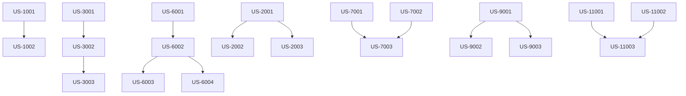

# User Stories: Phase 4 - Feature Completion

**Version:** 2.0  
**Last Updated:** January 25, 2026  
**Status:** Active  

---

## Overview

This document contains detailed user stories for all remaining features identified in the product gap analysis. Stories are organized by epic and include acceptance criteria, technical notes, and priority.

---

## Table of Contents

1. [Epic 1: Chat-Style Generation Experience](#epic-1-chat-style-generation-experience) ⭐ **Foundation**
2. [Epic 2: Component File Management](#epic-2-component-file-management)
3. [Epic 3: File Alignment & CAD Combination](#epic-3-file-alignment--cad-combination)
4. [Epic 4: AI Dimension Extraction](#epic-4-ai-dimension-extraction)
5. [Epic 5: Enclosure Style Templates](#epic-5-enclosure-style-templates)
6. [Epic 6: Mounting Type Expansion](#epic-6-mounting-type-expansion)
7. [Epic 7: Payment & Subscription](#epic-7-payment--subscription)
8. [Epic 8: OAuth Authentication](#epic-8-oauth-authentication)
9. [Epic 9: Real-time Updates](#epic-9-real-time-updates)
10. [Epic 10: Collaboration Features](#epic-10-collaboration-features)
11. [Epic 11: Onboarding Experience](#epic-11-onboarding-experience)
12. [Epic 12: Layout Editor Enhancements](#epic-12-layout-editor-enhancements)

---

## Epic 1: Chat-Style Generation Experience

> **Why First?** This epic establishes the conversational UI pattern that will be reused across many other features (component refinement, enclosure customization, AI extraction review). Building it first creates a foundation for iterative user interactions.

### US-1001: Iterative Design Chat Interface

**As a** user refining my enclosure design,  
**I want** a chat-like interface for iterative generation,  
**So that** I can refine my design through conversation rather than starting over.

| Attribute | Value |
|-----------|---------|
| **Priority** | P0 - Launch Blocker |
| **Points** | 5 |
| **Sprint** | 36 |

**Acceptance Criteria:**

```gherkin
Scenario: First-time generation shows example prompts
  Given I am on the generation page
  And I have not generated any designs yet
  Then I see a list of example prompts
  And I see an input field at the bottom
  And the button says "Generate"

Scenario: Example prompts hidden after first generation
  Given I am on the generation page
  When I submit a prompt and generation completes
  Then the example prompts div is hidden
  And I see my prompt in a chat bubble (user style)
  And I see the generation result in a chat bubble (assistant style)

Scenario: Chat interface after generation
  Given I have generated at least one design
  Then I see a scrollable history of prompts and responses
  And the input field is fixed at the bottom
  And the button says "Regenerate"
  And the placeholder text says "Describe changes to your design..."

Scenario: Submit with keyboard
  Given I am in the chat input field
  When I type a prompt and press Enter
  Then the prompt is submitted
  And Shift+Enter creates a new line instead
```

**UI Mockup:**
```
┌────────────────────────────────────────────┐
│  📦 Enclosure Generator                    │
├────────────────────────────────────────────┤
│                                            │
│  ┌──────────────────────────────────────┐  │
│  │     (Before first generation)        │  │
│  │                                      │  │
│  │  Not sure where to start?            │  │
│  │  Try one of these:                   │  │
│  │                                      │  │
│  │  ┌────────────────────────────────┐  │  │
│  │  │ "Create a simple enclosure..." │  │  │
│  │  └────────────────────────────────┘  │  │
│  │  ┌────────────────────────────────┐  │  │
│  │  │ "Design a wall-mountable..."   │  │  │
│  │  └────────────────────────────────┘  │  │
│  │                                      │  │
│  └──────────────────────────────────────┘  │
│                                            │
├────────────────────────────────────────────┤
│  [Describe what you want...]  [Generate]   │
└────────────────────────────────────────────┘

           ↓ After first generation ↓

┌────────────────────────────────────────────┐
│  📦 Enclosure Generator                    │
├────────────────────────────────────────────┤
│                                            │
│                    ┌─────────────────────┐ │
│                    │ Create an enclosure │ │
│                    │ for Raspberry Pi 4  │ │
│                    └─────────────────────┘ │
│                                            │
│  ┌─────────────────────────────────┐       │
│  │ Generated design based on:      │       │
│  │ "Create an enclosure for..."    │       │
│  │ ┌─────────────────────────────┐ │       │
│  │ │      [3D Preview Image]     │ │       │
│  │ └─────────────────────────────┘ │       │
│  │ View full design →              │       │
│  └─────────────────────────────────┘       │
│                                            │
│                    ┌─────────────────────┐ │
│                    │ Add ventilation     │ │
│                    │ on the top          │ │
│                    └─────────────────────┘ │
│                                            │
├────────────────────────────────────────────┤
│  [Describe changes...]     [Regenerate]    │
└────────────────────────────────────────────┘
```

**Technical Notes:**
- Store conversation history in component state (not persisted to DB initially)
- Consider persisting to localStorage for session continuity
- Future: Persist to DB for full history across sessions

---

### US-1002: Generation Thumbnails in Chat

**As a** user viewing my generation history,  
**I want** to see thumbnails of each generated design in the chat,  
**So that** I can visually compare iterations.

| Attribute | Value |
|-----------|---------|
| **Priority** | P0 |
| **Points** | 3 |
| **Sprint** | 36 |

**Acceptance Criteria:**

```gherkin
Scenario: Thumbnail in response bubble
  Given I have generated a design
  Then the assistant message shows a thumbnail
  And clicking the thumbnail opens the full 3D viewer

Scenario: Multiple iterations visible
  Given I have generated 3 iterations
  Then I can scroll up to see all 3 thumbnails
  And each has a "View full design" link
```

---

## Epic 2: Component File Management

### US-2001: Replace CAD File for Existing Component

**As a** maker who has uploaded a reference component,  
**I want** to replace the CAD file (STEP/STL) with an updated version,  
**So that** I can iterate on my component specifications without creating a new component entry.

| Attribute | Value |
|-----------|-------|
| **Priority** | P0 - Launch Blocker |
| **Points** | 5 |
| **Sprint** | 36-37 |

**Context:**  
Users often receive updated CAD files from suppliers or make modifications to their component models. Currently, they must delete the old component and create a new one, losing history and project associations.

**Acceptance Criteria:**

```gherkin
Scenario: Replace CAD file via component detail page
  Given I am viewing a component I own
  And the component has an existing STEP file attached
  When I click "Update Files" button
  And I upload a new STEP file
  Then the new file replaces the old one
  And the old file is archived for version history
  And the component's updated_at timestamp is refreshed

Scenario: Replace CAD file triggers re-extraction
  Given I am uploading a replacement CAD file
  When I check "Re-run dimension extraction" option
  And I complete the upload
  Then a new extraction job is queued
  And I see "Extraction in progress" status

Scenario: View file version history
  Given I have replaced a component's CAD file multiple times
  When I open the file history panel
  Then I see a list of all previous file versions
  And each version shows filename, date, and file size
  And I can download any previous version

Scenario: Restore previous file version
  Given I am viewing file history for a component
  When I click "Restore" on a previous version
  Then that version becomes the current file
  And a new history entry is created
```

**UI Mockup:**
```
┌─────────────────────────────────────────────────────────────┐
│ Component: Raspberry Pi 4 Model B                          │
├─────────────────────────────────────────────────────────────┤
│ ┌─────────────────┐  Files                                  │
│ │                 │  ├── raspberry-pi-4.step  [Current]     │
│ │   [3D Preview]  │  │   Uploaded: Jan 25, 2026             │
│ │                 │  │   [Download] [Update]                │
│ └─────────────────┘  │                                      │
│                      ├── datasheet.pdf                      │
│                      │   [Download] [Update]                │
│                      │                                      │
│                      └── File History (3 versions)  [View]  │
└─────────────────────────────────────────────────────────────┘
```

**Technical Notes:**
- API: `PUT /api/v1/components/{id}/files`
- Store old files with timestamp suffix in archive folder
- Update `ReferenceComponent.cad_file_url` and `cad_file_updated_at`
- Optional: trigger `ComponentExtractionJob` on upload

---

### US-1002: Replace Datasheet PDF for Component

**As a** maker who uploaded a PDF datasheet for a component,  
**I want** to upload an updated datasheet,  
**So that** the AI can extract more accurate dimensions from the newer documentation.

| Attribute | Value |
|-----------|-------|
| **Priority** | P0 |
| **Points** | 3 |
| **Sprint** | 36-37 |

**Acceptance Criteria:**

```gherkin
Scenario: Replace datasheet PDF
  Given I am viewing a component with an attached PDF datasheet
  When I click "Update" next to the datasheet
  And I upload a new PDF file
  Then the new PDF replaces the old one
  And AI extraction is automatically triggered
  And I see "Analyzing datasheet..." status

Scenario: Cancel datasheet replacement
  Given I have started uploading a new datasheet
  When I click "Cancel" before upload completes
  Then the original datasheet remains unchanged
  And no extraction job is created
```

---

### US-1003: Bulk File Update for Multiple Components

**As a** user with many components in a project,  
**I want** to update files for multiple components at once,  
**So that** I can efficiently refresh my component library after receiving updated specs.

| Attribute | Value |
|-----------|-------|
| **Priority** | P2 |
| **Points** | 5 |
| **Sprint** | Future |

**Acceptance Criteria:**
- [ ] Select multiple components in list view
- [ ] "Update Files" action appears in bulk actions menu
- [ ] Upload dialog allows mapping files to components by name
- [ ] Progress indicator shows update status for each component

---

## Epic 2: File Alignment & CAD Combination

### US-2001: Align Two CAD Files

**As a** maker combining multiple parts,  
**I want** to align two CAD files relative to each other,  
**So that** I can create assemblies from separate components.

| Attribute | Value |
|-----------|-------|
| **Priority** | P1 |
| **Points** | 8 |
| **Sprint** | 36-37 |

**Context:**  
When designing enclosures for multiple components, users need to position parts relative to each other. Without alignment tools, they must export to external CAD software.

**Acceptance Criteria:**

```gherkin
Scenario: Align by center
  Given I have two STEP files uploaded
  When I open the alignment editor
  And I select "Align by center" mode
  And I select both files
  Then the second file moves so its center aligns with the first
  And I see the aligned preview in 3D

Scenario: Align by face
  Given I am in the alignment editor with two files
  When I select "Align by face" mode
  And I click a face on the first object
  And I click a face on the second object
  Then the second object moves so the selected faces are coplanar

Scenario: Apply offset after alignment
  Given two objects are aligned by center
  When I enter offset values (X: 0, Y: 0, Z: 10)
  Then the second object moves 10mm up from the aligned position
  And I can see the offset in the preview

Scenario: Save alignment as assembly
  Given I have aligned multiple files
  When I click "Save as Assembly"
  And I enter assembly name "Pi + Display Assembly"
  Then an assembly record is created
  And I can find it in my Assemblies list
```

**UI Mockup:**
```
┌─────────────────────────────────────────────────────────────────────────┐
│ Alignment Editor                                          [Save] [Cancel]│
├───────────────────────┬─────────────────────────────────────────────────┤
│ Files                 │                                                 │
│ ┌───────────────────┐ │                                                 │
│ │ ☑ pi-case.step    │ │            ┌─────────────────────┐              │
│ │ ☑ lcd-mount.step  │ │            │                     │              │
│ │ ☐ button.step     │ │            │   [3D Preview]      │              │
│ └───────────────────┘ │            │                     │              │
│                       │            └─────────────────────┘              │
│ Alignment Mode        │                                                 │
│ ○ Center              │  Transform Controls                             │
│ ● Face                │  X: [  0.00 ] mm                                │
│ ○ Edge                │  Y: [  0.00 ] mm                                │
│ ○ Origin              │  Z: [ 10.00 ] mm                                │
│                       │  Rotation: [ 0 ]°                               │
│ Presets               │                                                 │
│ [Stack] [Side] [Center]│                                                │
└───────────────────────┴─────────────────────────────────────────────────┘
```

**Technical Notes:**
- Use Three.js TransformControls for interactive positioning
- Store transformations as 4x4 matrices in Assembly model
- Backend uses CadQuery to apply transforms and export

---

### US-2002: Use Alignment Presets

**As a** user who frequently performs common alignments,  
**I want** to use preset alignment configurations,  
**So that** I can quickly position components without manual adjustment.

| Attribute | Value |
|-----------|-------|
| **Priority** | P1 |
| **Points** | 3 |
| **Sprint** | 36-37 |

**Presets:**
- **Stack:** Place second object on top of first
- **Side-by-side:** Place objects next to each other (X axis)
- **Center:** Align centers with configurable spacing
- **Flush back:** Align back faces

**Acceptance Criteria:**
- [ ] Preset buttons visible in alignment toolbar
- [ ] Clicking preset immediately applies transformation
- [ ] User can fine-tune after applying preset
- [ ] Presets respect component bounding boxes

---

### US-2003: Export Combined Assembly

**As a** user who has aligned multiple components,  
**I want** to export the combined assembly as a single file,  
**So that** I can use it in my enclosure design or share with others.

| Attribute | Value |
|-----------|-------|
| **Priority** | P1 |
| **Points** | 3 |
| **Sprint** | 36-37 |

**Acceptance Criteria:**

```gherkin
Scenario: Export assembly as STEP
  Given I have saved an assembly with 3 aligned components
  When I click "Export" and select "STEP" format
  Then I receive a single STEP file containing all components
  And each component maintains its relative position

Scenario: Export assembly as STL
  Given I have an assembly
  When I export as STL with "Merge meshes" option checked
  Then I receive a single STL with unified geometry

Scenario: Export assembly with separate parts
  Given I have an assembly
  When I export as STEP with "Keep separate" option
  Then I receive a STEP file with distinct bodies for each component
```

---

## Epic 3: AI Dimension Extraction

### US-3001: Extract Dimensions from PDF Mechanical Drawings

**As a** user who has uploaded a component datasheet PDF,  
**I want** the AI to analyze mechanical drawings and extract dimensions,  
**So that** I don't have to manually enter component specifications.

| Attribute | Value |
|-----------|-------|
| **Priority** | P0 - Launch Blocker |
| **Points** | 8 |
| **Sprint** | 38-39 |

**Context:**  
Component datasheets contain mechanical drawings with dimensions, but extracting this data manually is tedious and error-prone. GPT-4 Vision can analyze these drawings.

**Acceptance Criteria:**

```gherkin
Scenario: Automatic extraction on PDF upload
  Given I am uploading a PDF datasheet for a new component
  When the upload completes
  Then AI extraction begins automatically
  And I see "Analyzing datasheet..." with progress indicator
  And extraction completes within 60 seconds

Scenario: Extract overall dimensions
  Given the PDF contains a mechanical drawing with overall dimensions
  When extraction completes
  Then the component's length, width, and height are populated
  And each dimension includes a confidence score

Scenario: Extract mounting holes
  Given the PDF shows a mounting hole pattern
  When extraction completes
  Then mounting holes are listed with X, Y positions
  And hole diameters and thread sizes (if shown) are captured

Scenario: Extract connector locations
  Given the PDF shows ports/connectors on the component
  When extraction completes
  Then connectors are listed with position and cutout dimensions
  And connector types (USB, HDMI, etc.) are identified

Scenario: Handle multi-page PDFs
  Given I upload a 20-page datasheet
  When extraction runs
  Then the system identifies pages with mechanical drawings
  And only relevant pages are sent to vision API
  And extraction focuses on dimensional data
```

**Technical Notes:**
- Use GPT-4 Vision API with high detail setting
- Convert PDF pages to PNG at 300 DPI
- Page detection heuristics to find mechanical drawings
- Return structured JSON with confidence scores

---

### US-3002: Review and Correct AI Extractions

**As a** user reviewing AI-extracted dimensions,  
**I want** to see the extractions overlaid on the original document,  
**So that** I can verify accuracy and correct any errors.

| Attribute | Value |
|-----------|-------|
| **Priority** | P1 |
| **Points** | 5 |
| **Sprint** | 38-39 |

**Acceptance Criteria:**

```gherkin
Scenario: View extraction overlay
  Given AI extraction has completed for a component
  When I open the extraction review screen
  Then I see the PDF page with dimension annotations overlaid
  And extracted values are highlighted with colored boxes
  And confidence is indicated by color (green=high, yellow=medium, red=low)

Scenario: Edit extracted value
  Given I see an incorrect dimension value (shows 84mm, should be 85mm)
  When I click on the dimension annotation
  Then an edit field appears with current value
  When I change it to 85mm and save
  Then the component specification is updated
  And the extraction is marked as "manually verified"

Scenario: Add missing dimension
  Given a dimension was not automatically detected
  When I click "Add Dimension" 
  And I draw a box around the dimension in the PDF
  And I enter the value
  Then the dimension is added to the component
  And extraction improves for similar documents (feedback loop)

Scenario: Mark extraction as verified
  Given I have reviewed all extracted dimensions
  When I click "Mark as Verified"
  Then the component shows "Specifications Verified" badge
  And verified components appear higher in search results
```

**UI Mockup:**
```
┌─────────────────────────────────────────────────────────────────────────┐
│ Extraction Review: Raspberry Pi 4 Model B                [Save] [Verify]│
├─────────────────────────────────────┬───────────────────────────────────┤
│ ┌─────────────────────────────────┐ │ Extracted Specifications          │
│ │                                 │ │                                   │
│ │   [PDF with annotations]        │ │ Dimensions:                       │
│ │   ┌──────┐                      │ │   Length: 85mm ✓ (98%)            │
│ │   │84x56 │←── Highlight         │ │   Width:  56mm ✓ (95%)            │
│ │   └──────┘                      │ │   Height: 17mm ⚠ (72%)  [Edit]    │
│ │                                 │ │                                   │
│ │   Page 1 of 3  [<] [>]          │ │ Mounting Holes:                   │
│ └─────────────────────────────────┘ │   (3.5, 3.5) ø2.75mm             │
│                                     │   (3.5, 52.5) ø2.75mm            │
│ Zoom: [+] [-] [Fit]                 │   (61.5, 3.5) ø2.75mm            │
│                                     │   (61.5, 52.5) ø2.75mm           │
│ [Re-analyze this page]              │                                   │
│                                     │ [+ Add Dimension]                 │
└─────────────────────────────────────┴───────────────────────────────────┘
```

---

### US-3003: Re-analyze Specific Region

**As a** user who sees a dimension was missed,  
**I want** to select a region of the PDF for focused analysis,  
**So that** the AI can find dimensions it initially missed.

| Attribute | Value |
|-----------|-------|
| **Priority** | P2 |
| **Points** | 3 |
| **Sprint** | 38-39 |

**Acceptance Criteria:**
- [ ] Can draw rectangle on PDF to select region
- [ ] "Analyze Selection" button sends cropped image to GPT-4V
- [ ] Results merge with existing extractions
- [ ] Duplicate dimensions are deduplicated

---

## Epic 4: Enclosure Style Templates

### US-4001: Select Enclosure Style Template

**As a** user generating an enclosure,  
**I want** to choose from predefined style templates,  
**So that** the design matches my aesthetic and functional requirements.

| Attribute | Value |
|-----------|-------|
| **Priority** | P1 |
| **Points** | 3 |
| **Sprint** | 38-39 |

**Available Styles:**

| Style | Description | Use Case |
|-------|-------------|----------|
| Minimal | Thin walls, simple box | Prototypes, indoor use |
| Rugged | Thick walls, rounded corners, gasket groove | Outdoor, industrial |
| Stackable | Interlocking edges, alignment pins | Modular systems |
| Industrial | DIN rail mount, terminal cutouts | Control panels |
| Desktop | Angled front, rubber feet | User-facing devices |
| Handheld | Ergonomic curves, battery compartment | Portable devices |

**Acceptance Criteria:**

```gherkin
Scenario: Browse style templates
  Given I am on the enclosure generation page
  When I reach the "Select Style" step
  Then I see a grid of style cards with preview images
  And each card shows style name and brief description

Scenario: Select a style
  Given I am viewing style templates
  When I click on "Rugged" style card
  Then the card shows a selected indicator
  And the 3D preview updates to show rugged style
  And style-specific parameters appear in the form

Scenario: Preview style before selecting
  Given I hover over a style card
  When I remain hovered for 1 second
  Then a larger preview image appears
  And key characteristics are listed
```

---

### US-4002: Configure Rugged Style Parameters

**As a** user who selected the Rugged enclosure style,  
**I want** to configure rugged-specific parameters,  
**So that** I can customize the level of protection.

| Attribute | Value |
|-----------|-------|
| **Priority** | P1 |
| **Points** | 3 |
| **Sprint** | 38-39 |

**Rugged Parameters:**
- Wall thickness: 3-6mm (default: 4mm)
- Corner radius: 5-15mm (default: 8mm)
- Gasket groove: yes/no
- IP rating target: IP54, IP65, IP67
- Screw size: M3, M4, M5

**Acceptance Criteria:**
- [ ] Parameters form appears when rugged style selected
- [ ] 3D preview updates as parameters change
- [ ] Wall thickness affects interior dimensions (shown)
- [ ] IP rating presets adjust multiple parameters at once

---

### US-4003: Generate Stackable Enclosure

**As a** user building a modular system,  
**I want** to generate enclosures that stack and interlock,  
**So that** I can build expandable installations.

| Attribute | Value |
|-----------|-------|
| **Priority** | P1 |
| **Points** | 3 |
| **Sprint** | 38-39 |

**Stackable Parameters:**
- Interlock depth: 2-5mm
- Alignment pin diameter: 3-5mm
- Maximum recommended stack: 3-8 units
- Stack direction: vertical, horizontal, both

**Acceptance Criteria:**

```gherkin
Scenario: Generate stackable enclosure pair
  Given I selected "Stackable" style
  And I configured interlock depth as 3mm
  When I generate the enclosure
  Then the lid has protruding interlock ridges
  And the base has matching recesses
  And two enclosures preview stacking correctly

Scenario: Preview stacked assembly
  Given I have generated a stackable enclosure
  When I click "Preview Stacked"
  Then the 3D viewer shows 3 enclosures stacked
  And alignment pins are visible at interfaces
```

---

### US-4004: Save Custom Style Preset

**As a** Pro user who has customized style parameters,  
**I want** to save my configuration as a custom preset,  
**So that** I can reuse it in future projects.

| Attribute | Value |
|-----------|-------|
| **Priority** | P2 |
| **Points** | 3 |
| **Sprint** | 38-39 |

**Acceptance Criteria:**
- [ ] "Save as Custom Style" button appears for Pro users
- [ ] Can name the custom style
- [ ] Custom styles appear in style picker
- [ ] Can edit or delete custom styles

---

## Epic 5: Mounting Type Expansion

### US-5001: Generate Snap-Fit Mounting Clips

**As a** user designing for tool-less assembly,  
**I want** snap-fit clips to hold components,  
**So that** users can easily insert and remove components without screws.

| Attribute | Value |
|-----------|-------|
| **Priority** | P1 |
| **Points** | 3 |
| **Sprint** | 38-39 |

**Snap-Fit Parameters:**
- Clip height: 3-8mm
- Deflection: 1-2mm
- Engagement angle: 30-45°
- Release angle: 60-90°

**Acceptance Criteria:**

```gherkin
Scenario: Add snap-fit clip to component
  Given I am in the layout editor
  And I have a component placed in the enclosure
  When I select "Mounting Type" for the component
  And I choose "Snap-fit clips"
  Then snap-fit clips appear around the component edges
  And I can adjust clip positions

Scenario: Configure clip parameters
  Given I have snap-fit clips selected
  When I adjust "Clip height" to 5mm
  Then the 3D preview updates with taller clips
  And the component engagement depth increases
```

**Technical Notes:**
- Generate cantilever beam clips with proper geometry
- Calculate deflection to avoid plastic deformation
- Add fillet at base to reduce stress concentration

---

### US-5002: Generate DIN Rail Mount

**As a** user designing for industrial control panels,  
**I want** DIN rail mounting brackets,  
**So that** the enclosure mounts to standard 35mm DIN rails.

| Attribute | Value |
|-----------|-------|
| **Priority** | P1 |
| **Points** | 3 |
| **Sprint** | 38-39 |

**DIN Rail Parameters:**
- Rail width: 35mm (standard), 15mm (mini)
- Clip type: spring, fixed
- Orientation: horizontal, vertical

**Acceptance Criteria:**

```gherkin
Scenario: Add DIN rail mount to enclosure
  Given I am configuring enclosure generation
  When I select "DIN rail mount" as mounting option
  Then DIN rail clips are added to the back of the enclosure
  And the enclosure dimensions accommodate the clips

Scenario: Preview on DIN rail
  Given my enclosure has DIN rail mounting
  When I click "Preview on Rail"
  Then the 3D viewer shows enclosure mounted on a DIN rail
  And I can slide the enclosure along the rail in preview
```

---

### US-5003: Generate Wall Mount Brackets

**As a** user installing enclosures on walls,  
**I want** wall mounting options,  
**So that** I can securely attach the enclosure.

| Attribute | Value |
|-----------|-------|
| **Priority** | P2 |
| **Points** | 3 |
| **Sprint** | 38-39 |

**Wall Mount Types:**
- Keyhole slots (slide-on, tool-less)
- Screw-through holes
- Integrated bracket with screws

**Acceptance Criteria:**
- [ ] Can select wall mount type per enclosure side
- [ ] Keyhole slots have proper geometry for #8 screws
- [ ] Screw spacing is configurable
- [ ] Export includes mounting template PDF

---

### US-5004: Generate Heat-Set Insert Bosses

**As a** user 3D printing enclosures,  
**I want** properly sized bosses for heat-set inserts,  
**So that** I can use metal threads for repeated assembly.

| Attribute | Value |
|-----------|-------|
| **Priority** | P2 |
| **Points** | 3 |
| **Sprint** | 38-39 |

**Insert Sizes:**
| Size | Hole Diameter | Boss OD | Depth |
|------|--------------|---------|-------|
| M2 | 3.2mm | 5.5mm | 4.0mm |
| M2.5 | 3.8mm | 6.0mm | 5.0mm |
| M3 | 4.5mm | 7.0mm | 5.5mm |
| M4 | 5.6mm | 9.0mm | 7.0mm |

**Acceptance Criteria:**

```gherkin
Scenario: Select heat-set inserts for lid screws
  Given I am configuring enclosure lid attachment
  When I select "Heat-set inserts" as fastener type
  And I choose M3 size
  Then the base has bosses with 4.5mm holes
  And the boss outer diameter is 7.0mm
  And the depth is 5.5mm
```

---

## Epic 6: Payment & Subscription

### US-6001: View Pricing and Subscription Tiers

**As a** visitor evaluating the platform,  
**I want** to see clear pricing information,  
**So that** I can choose the right plan for my needs.

| Attribute | Value |
|-----------|-------|
| **Priority** | P0 - Launch Blocker |
| **Points** | 5 |
| **Sprint** | 40-41 |

**Tier Comparison:**

| Feature | Free | Pro ($15/mo) | Enterprise ($99/mo) |
|---------|------|--------------|---------------------|
| Generations/month | 10 | 100 | Unlimited |
| Storage | 100 MB | 5 GB | 50 GB |
| Components | 5 | 50 | Unlimited |
| Export formats | STL | STL, STEP, 3MF | All + OBJ |
| Priority queue | ❌ | ✅ | ✅ |
| API access | ❌ | ❌ | ✅ |
| Support | Community | Email | Priority |

**Acceptance Criteria:**

```gherkin
Scenario: View pricing page
  Given I am a visitor on the website
  When I click "Pricing" in the navigation
  Then I see a comparison table of all tiers
  And features are clearly listed with checkmarks/X
  And monthly and yearly pricing is shown

Scenario: Toggle annual billing
  Given I am on the pricing page
  When I toggle "Annual billing"
  Then prices update to show yearly rates
  And I see "2 months free" badge on Pro/Enterprise
  And the monthly equivalent is shown

Scenario: See current plan indicator
  Given I am logged in as a Pro subscriber
  When I visit the pricing page
  Then my current plan shows "Current Plan" badge
  And upgrade/downgrade options are shown for other tiers
```

---

### US-6002: Subscribe to Pro Plan

**As a** free user who wants more features,  
**I want** to upgrade to Pro,  
**So that** I can access priority queue and more exports.

| Attribute | Value |
|-----------|-------|
| **Priority** | P0 - Launch Blocker |
| **Points** | 8 |
| **Sprint** | 40-41 |

**Acceptance Criteria:**

```gherkin
Scenario: Start Pro subscription
  Given I am logged in as a free user
  And I am on the pricing page
  When I click "Upgrade to Pro"
  Then I am redirected to Stripe Checkout
  And the checkout shows Pro plan details
  And I can enter payment information

Scenario: Complete successful payment
  Given I am on Stripe Checkout for Pro plan
  When I enter valid payment details and submit
  Then I am redirected back to the app
  And I see "Welcome to Pro!" confirmation
  And my account immediately shows Pro features
  And I receive a confirmation email

Scenario: Handle payment failure
  Given I am on Stripe Checkout
  When I enter a declined card
  Then I see an error message
  And I can retry with different payment method
  And my account remains on Free tier
```

---

### US-6003: Manage Billing and Subscription

**As a** paying subscriber,  
**I want** to manage my subscription,  
**So that** I can update payment methods or cancel.

| Attribute | Value |
|-----------|-------|
| **Priority** | P1 |
| **Points** | 5 |
| **Sprint** | 40-41 |

**Acceptance Criteria:**

```gherkin
Scenario: Access billing portal
  Given I am logged in as a Pro subscriber
  When I go to Settings > Billing
  And I click "Manage Subscription"
  Then I am redirected to Stripe Customer Portal
  And I can view invoices, update payment, or cancel

Scenario: Cancel subscription
  Given I am in the Stripe Customer Portal
  When I click "Cancel subscription"
  And I confirm cancellation
  Then my subscription is set to cancel at period end
  And I return to app seeing "Canceling at [date]" status
  And I retain Pro access until the period ends

Scenario: View usage statistics
  Given I am on Settings > Billing
  Then I see my current usage:
  - Generations: 45 of 100 used
  - Storage: 2.3 GB of 5 GB used
  - Components: 23 of 50 used
```

---

### US-6004: Enforce Tier Limits

**As a** platform operator,  
**I want** feature limits enforced by subscription tier,  
**So that** free users are encouraged to upgrade.

| Attribute | Value |
|-----------|-------|
| **Priority** | P0 |
| **Points** | 5 |
| **Sprint** | 40-41 |

**Acceptance Criteria:**

```gherkin
Scenario: Block generation when limit reached
  Given I am a free user who has used 10 generations this month
  When I try to generate a new part
  Then I see "Monthly limit reached" message
  And I see "Upgrade to Pro for 100 generations" CTA
  And the generation is blocked

Scenario: Block STEP export for free users
  Given I am a free user viewing a generated part
  When I try to export as STEP
  Then I see "STEP export requires Pro" message
  And only STL export is available

Scenario: Warn when approaching limit
  Given I am a free user with 8 of 10 generations used
  When I view the dashboard
  Then I see "2 generations remaining this month" warning
  And a subtle upgrade prompt is shown
```

---

## Epic 7: OAuth Authentication

### US-7001: Sign In with Google

**As a** user who prefers not to create a new password,  
**I want** to sign in with my Google account,  
**So that** I can access the platform quickly and securely.

| Attribute | Value |
|-----------|-------|
| **Priority** | P1 |
| **Points** | 5 |
| **Sprint** | 40-41 |

**Acceptance Criteria:**

```gherkin
Scenario: Sign in with Google (new user)
  Given I am on the login page
  When I click "Continue with Google"
  Then I am redirected to Google sign-in
  When I authorize the application
  Then I am redirected back to the app
  And a new account is created with my Google email
  And I am logged in and see the dashboard

Scenario: Sign in with Google (existing user)
  Given I previously registered with email@example.com
  And I sign in with Google using the same email
  Then my existing account is linked to Google
  And I can sign in with either method

Scenario: Import profile from Google
  Given I complete Google sign-in for the first time
  Then my display name is set from Google profile
  And my avatar is imported from Google
```

---

### US-7002: Sign In with GitHub

**As a** developer who uses GitHub,  
**I want** to sign in with my GitHub account,  
**So that** I can use my existing identity.

| Attribute | Value |
|-----------|-------|
| **Priority** | P1 |
| **Points** | 5 |
| **Sprint** | 40-41 |

**Acceptance Criteria:**
- [ ] "Continue with GitHub" button on login/register pages
- [ ] OAuth flow completes successfully
- [ ] New user created with GitHub email
- [ ] Profile picture imported from GitHub
- [ ] Username suggested from GitHub username

---

### US-7003: Link Additional OAuth Providers

**As a** user with an existing account,  
**I want** to link Google/GitHub to my account,  
**So that** I have multiple sign-in options.

| Attribute | Value |
|-----------|-------|
| **Priority** | P2 |
| **Points** | 3 |
| **Sprint** | 40-41 |

**Acceptance Criteria:**

```gherkin
Scenario: Link Google to existing account
  Given I am logged in with email/password
  When I go to Settings > Account > Connected Accounts
  And I click "Connect Google"
  And I complete Google authorization
  Then Google shows as connected
  And I can now sign in with either method

Scenario: Unlink OAuth provider
  Given I have both Google and email/password configured
  When I click "Disconnect" next to Google
  Then Google is removed from my account
  And I can only sign in with email/password
```

---

## Epic 8: Real-time Updates

### US-8001: See Real-time Job Progress

**As a** user who submitted a generation job,  
**I want** to see real-time progress updates,  
**So that** I know how long I need to wait.

| Attribute | Value |
|-----------|-------|
| **Priority** | P1 |
| **Points** | 5 |
| **Sprint** | 42 |

**Acceptance Criteria:**

```gherkin
Scenario: View live job progress
  Given I have submitted a part generation job
  When I am on the job status page
  Then I see a progress bar updating in real-time
  And I see status text: "Generating geometry..."
  And the progress updates without page refresh

Scenario: Job completes while watching
  Given I am viewing a job in progress
  When the job completes
  Then I immediately see "Complete" status
  And the preview image appears
  And "View Result" button becomes active
  And I hear a notification sound (if enabled)

Scenario: Handle job failure
  Given I am viewing a job in progress
  When the job fails
  Then I see "Failed" status with error message
  And "Retry" button appears
  And no page refresh was needed
```

---

### US-8002: Receive Real-time Notifications

**As a** user with background jobs running,  
**I want** to receive notifications when jobs complete,  
**So that** I can continue working and know when results are ready.

| Attribute | Value |
|-----------|-------|
| **Priority** | P2 |
| **Points** | 3 |
| **Sprint** | 42 |

**Notification Types:**
- Job completed successfully
- Job failed
- Someone shared a design with you
- Comment on your design
- Approaching storage/generation limit

**Acceptance Criteria:**
- [ ] Notification bell icon in header with unread count
- [ ] Real-time notifications appear without refresh
- [ ] Click notification navigates to relevant content
- [ ] Can mark notifications as read
- [ ] Notification preferences in settings

---

## Epic 9: Collaboration Features

### US-9001: Share Design with Collaborator

**As a** user who wants feedback on my design,  
**I want** to share it with a teammate,  
**So that** they can view and comment on it.

| Attribute | Value |
|-----------|-------|
| **Priority** | P1 |
| **Points** | 5 |
| **Sprint** | 42 |

**Acceptance Criteria:**

```gherkin
Scenario: Share design via email
  Given I am viewing one of my designs
  When I click "Share" button
  And I enter colleague@example.com
  And I select "Can comment" permission
  And I click "Send Invite"
  Then the colleague receives an email with share link
  And the design appears in their "Shared with Me" section

Scenario: Share with multiple people
  Given I am in the share dialog
  When I enter multiple email addresses
  Then each person receives an invite
  And I can set different permissions for each

Scenario: View who has access
  Given I have shared a design with 3 people
  When I open the share dialog
  Then I see a list of all people with access
  And I can change their permission level
  And I can remove their access
```

---

### US-9002: Comment on Shared Design

**As a** collaborator viewing a shared design,  
**I want** to leave comments,  
**So that** I can provide feedback to the designer.

| Attribute | Value |
|-----------|-------|
| **Priority** | P1 |
| **Points** | 5 |
| **Sprint** | 42 |

**Acceptance Criteria:**

```gherkin
Scenario: Add comment to design
  Given I have "comment" permission on a shared design
  When I click "Add Comment"
  And I type "The mounting holes look too small"
  And I click "Post"
  Then my comment appears in the comment thread
  And the design owner is notified

Scenario: Comment on specific 3D location
  Given I am viewing the 3D preview
  When I click on a point on the model
  And I add a comment
  Then the comment is anchored to that 3D location
  And clicking the comment highlights the location

Scenario: Reply to comment
  Given there is a comment on the design
  When I click "Reply"
  And I type my response
  Then my reply is threaded under the original

Scenario: Resolve comment thread
  Given I am the design owner
  And there is a comment thread
  When I click "Resolve"
  Then the thread is collapsed and marked resolved
  And resolved comments are hidden by default
```

---

### US-9003: Create Shareable Link

**As a** user who wants to share broadly,  
**I want** to create a shareable link,  
**So that** anyone with the link can view the design.

| Attribute | Value |
|-----------|-------|
| **Priority** | P1 |
| **Points** | 3 |
| **Sprint** | 42 |

**Acceptance Criteria:**

```gherkin
Scenario: Create view-only share link
  Given I am viewing my design
  When I click "Share" and then "Create Link"
  And I select "Anyone with link can view"
  Then a shareable URL is generated
  And I can copy it to clipboard
  And the link works without login

Scenario: Set link expiration
  Given I am creating a share link
  When I set expiration to "7 days"
  Then the link expires after 7 days
  And visitors see "Link expired" after that

Scenario: Disable share link
  Given I have created a share link
  When I click "Disable Link"
  Then the link stops working immediately
  And visitors see "Link no longer valid"
```

---

## Epic 10: Onboarding Experience

### US-10001: Complete Onboarding Tutorial

**As a** new user,  
**I want** a guided introduction to the platform,  
**So that** I can quickly learn how to use the key features.

| Attribute | Value |
|-----------|-------|
| **Priority** | P1 |
| **Points** | 3 |
| **Sprint** | 42 |

**Onboarding Steps:**
1. Welcome screen
2. Templates overview
3. AI generation demo
4. File management
5. Export options
6. Complete!

**Acceptance Criteria:**

```gherkin
Scenario: Start onboarding on first login
  Given I just created my account
  When I complete email verification
  And I am redirected to the dashboard
  Then the onboarding overlay appears
  And I see "Welcome to AI Part Designer!"

Scenario: Progress through onboarding steps
  Given I am on onboarding step 1
  When I click "Next"
  Then I see step 2 with a highlighted UI element
  And the progress indicator shows 2/6

Scenario: Skip onboarding
  Given I am in the onboarding flow
  When I click "Skip for now"
  Then onboarding closes
  And I see the regular dashboard
  And "Resume Tutorial" appears in help menu

Scenario: Resume onboarding later
  Given I previously skipped onboarding at step 3
  When I click "Resume Tutorial" in help menu
  Then onboarding resumes at step 3
```

---

### US-10002: Track Onboarding Completion

**As a** platform operator,  
**I want** to track onboarding completion rates,  
**So that** I can optimize the new user experience.

| Attribute | Value |
|-----------|-------|
| **Priority** | P1 |
| **Points** | 2 |
| **Sprint** | 42 |

**Acceptance Criteria:**
- [ ] User model has `onboarding_completed` boolean
- [ ] Timestamp stored when onboarding completed
- [ ] Analytics event fired on each step
- [ ] Drop-off can be analyzed by step

---

## Epic 11: Layout Editor Enhancements

### US-11001: Detect Component Collisions

**As a** user arranging components in an enclosure,  
**I want** to see warnings when components overlap,  
**So that** I can fix placement issues before generating.

| Attribute | Value |
|-----------|-------|
| **Priority** | P2 |
| **Points** | 5 |
| **Sprint** | 42 |

**Acceptance Criteria:**

```gherkin
Scenario: Visual collision warning
  Given I have two components in the layout
  When I drag one component to overlap with another
  Then both components turn red
  And a warning icon appears in the toolbar
  And I see "2 components overlapping"

Scenario: Collision prevents generation
  Given there are overlapping components
  When I click "Generate Enclosure"
  Then I see "Please resolve collisions first" error
  And the list of colliding components is shown

Scenario: Collision list
  Given there are multiple collisions
  When I click the warning icon
  Then I see a list of all collision pairs
  And clicking a pair selects those components
```

---

### US-11002: Visualize Clearance Zones

**As a** user placing components,  
**I want** to see clearance zones around each component,  
**So that** I ensure proper spacing for airflow and access.

| Attribute | Value |
|-----------|-------|
| **Priority** | P2 |
| **Points** | 3 |
| **Sprint** | 42 |

**Acceptance Criteria:**

```gherkin
Scenario: Show clearance zones
  Given I am in the layout editor
  When I toggle "Show Clearances" on
  Then translucent zones appear around each component
  And zones are color-coded:
  - Green: Adequate clearance
  - Yellow: Tight clearance
  - Red: Overlapping with another zone

Scenario: Configure clearance per component
  Given I have a heat-generating component selected
  When I open component properties
  And I set "Required clearance" to 10mm
  Then the clearance zone expands to 10mm
```

---

### US-11003: Auto-Arrange Components

**As a** user who has added many components,  
**I want** the system to automatically arrange them,  
**So that** I get a good starting layout quickly.

| Attribute | Value |
|-----------|-------|
| **Priority** | P2 |
| **Points** | 5 |
| **Sprint** | 42 |

**Auto-Arrange Algorithms:**
- **Grid:** Even rows and columns
- **Pack:** Minimize total footprint (bin-packing)
- **Thermal:** Separate heat sources

**Acceptance Criteria:**

```gherkin
Scenario: Auto-arrange with packing algorithm
  Given I have 6 components in the layout in random positions
  When I click "Auto-Arrange" and select "Pack"
  Then components are repositioned to minimize footprint
  And no components overlap
  And clearance zones are respected

Scenario: Auto-arrange with thermal awareness
  Given I have 2 heat-generating components and 4 others
  When I click "Auto-Arrange" and select "Thermal"
  Then heat sources are placed with maximum separation
  And heat sources are near enclosure walls (for venting)

Scenario: Undo auto-arrange
  Given I just ran auto-arrange
  When I click "Undo"
  Then components return to their previous positions
```

---

## Appendix: Story Prioritization Matrix

| Priority | Definition | Stories |
|----------|------------|---------|
| **P0** | Launch blocker - must complete | US-1001, US-1002, US-2001, US-2002, US-4001, US-7001, US-7002, US-7004 |
| **P1** | Core experience - should complete | US-3001, US-3002, US-3003, US-4002, US-5001, US-5002, US-6001, US-6002, US-7003, US-8001, US-8002, US-9001, US-10001, US-10002, US-10003, US-11001, US-11002 |
| **P2** | Nice to have - complete if time | US-2003, US-4003, US-4004, US-5003, US-5004, US-8003, US-12001, US-12002, US-12003 |

---

## Appendix: Story Dependencies



---

## Appendix: Acceptance Testing Checklist

### Sprint 36-37 Release Checklist
- [ ] Chat-style generation UI implemented
- [ ] Example prompts hidden after first generation
- [ ] Button changes to "Regenerate" after first generation
- [ ] Generation thumbnails display in chat bubbles
- [ ] Component file replacement works for STEP, STL
- [ ] File history shows all versions
- [ ] Alignment editor launches and loads files
- [ ] All 4 alignment modes work
- [ ] Assemblies can be saved and exported

### Sprint 38-39 Release Checklist
- [ ] PDF extraction works on sample datasheets
- [ ] Extraction review UI functional
- [ ] All 6 enclosure styles generate correctly
- [ ] All 6 mounting types generate correctly
- [ ] Style parameters update preview in real-time

### Sprint 40-41 Release Checklist
- [ ] Stripe checkout completes successfully
- [ ] Subscription status updates immediately
- [ ] Tier limits enforced correctly
- [ ] Google OAuth works end-to-end
- [ ] GitHub OAuth works end-to-end

### Sprint 42 Release Checklist
- [ ] WebSocket connects on page load
- [ ] Job progress updates in real-time
- [ ] Comments persist to database
- [ ] Share dialog works correctly
- [ ] Onboarding triggers on first login
- [ ] Collision detection works in layout editor
